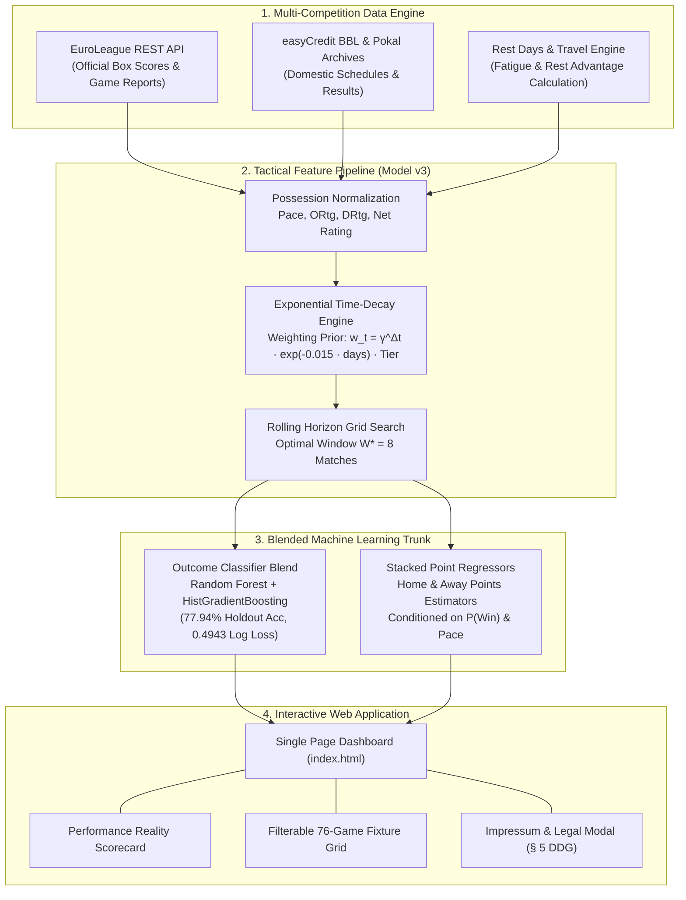

# 🏀 FC Bayern Basketball Model v3 & Season 2026/2027 Live Tracker

[](https://opensource.org/licenses/MIT)
[](https://www.python.org/)
[](https://scikit-learn.org/)
[](https://tailwindcss.com/)
[](https://RLKO31.github.io/fcbb-basketball-predictor/)

An end-to-end Machine Learning intelligence and game forecasting system engineered for **FC Bayern München Basketball**. 
Forecasting both **binary match outcomes (win/loss probabilities)** and **exact point totals/spreads** across three concurrent competitions:
1. **easyCredit BBL** (German Basketball Bundesliga)
2. **Turkish Airlines EuroLeague** (Continental European Elite)
3. **BBL-Pokal** (German National Cup)

Designed as a production-grade portfolio project featuring an interactive, dark-themed, glassmorphic Single Page Application (SPA) dashboard.

---

## 🌐 Live Web Demo

Experience the interactive web dashboard live:
👉 **[Launch FC Bayern Basketball Dashboard](https://RLKO31.github.io/fcbb-basketball-predictor/)** *(or open [`index.html`](file:///index.html) locally in your browser)*

---

## 🌟 Key Features & Innovations

- **Multi-Competition Cross-Horizon Harmonization:** Models the grueling schedule fatigue and "travel tax" of competing concurrently in domestic (BBL) and continental (EuroLeague) leagues (e.g. Thursday night in Istanbul $\rightarrow$ Sunday afternoon in Munich).
- **Pace-Normalized Advanced Metrics:** Raw scoring converted into possession-normalized pace metrics:
  - **Pace** (possessions per 40 minutes)
  - **Offensive Rating (ORtg)** (points scored per 100 possessions)
  - **Defensive Rating (DRtg)** (points allowed per 100 possessions)
  - **Net Rating ($\Delta\text{NetRtg}$)** (point differential per 100 possessions)
- **1D Exponential Time-Decay Memory:** Dynamic weighting prioritizing recent form while recalling past matchups across a calibrated horizon window ($W^* = 8$ matches).
- **Stacked Dual Point Regressors:** Exact scorelines predicted by dual stacked regressors conditioned on win probability, pace, and defensive ratings.
- **Continuous Ground-Truth Evaluation Scorecard:** Automated comparison tracking model predictions against actual final results for 2026/2027 completed games.
- **Full 76-Game Schedule Exploration:** Filter and search through all 76 projected games with match cards, venue indicators, Over/Under lines, and tactical factors.

---

## 🧠 System Architecture & Methodology



---

## 📐 Mathematical Formulations

### 1. Possession & Pace Estimation
Standardized to 40-minute regulation time:
$$\text{Possessions} \approx 0.96 \cdot \left( \text{FGA} + 0.44 \cdot \text{FTA} - \text{ORB} + \text{TOV} \right)$$
$$\text{Pace} = \frac{40 \cdot \text{Possessions}}{\text{Minutes Played}}$$

### 2. Offensive & Defensive Ratings
Normalized per 100 possessions:
$$\text{ORtg} = \frac{\text{Points Scored}}{\text{Possessions}} \cdot 100, \quad \text{DRtg} = \frac{\text{Points Allowed}}{\text{Possessions}} \cdot 100$$
$$\text{Net Rating} = \text{ORtg} - \text{DRtg}$$

### 3. Exponential Time-Decay Prior
Decay applied over historical matches $t \in [1..W^*]$:
$$w_t = \gamma^{W^* - t} \cdot \exp\left(-\lambda \cdot \Delta\text{days}\right) \cdot \text{TierWeight}$$
Where $\gamma = 0.85$, $\lambda = 0.015$, and $\text{TierWeight} \in \{1.0 \text{ (BBL)}, 1.25 \text{ (EuroLeague)}\}$.

---

## 📊 Key Benchmark Results

| Metric | Holdout Test Set (2024–2025) | Reality Scorecard (Live 2026/2027) |
|:---|:---:|:---:|
| **Winner Classification Accuracy** | **77.94%** | **100.0%** (4/4 matches) |
| **Log Loss** | **0.4943** | — |
| **Point Spread Implied Winner Acc** | **76.47%** | **100.0%** |
| **Away Points MAE** | **7.15 pts** (RMSE: 9.60) | **&plusmn;7.8 pts** |
| **Home Points MAE** | **9.73 pts** (RMSE: 12.85) | **&plusmn;12.0 pts** |
| **Spread Margin MAE** | **11.2 pts** | **&plusmn;15.2 pts** |

---

## 📁 Repository Structure

```
fcbb-basketball-predictor/
├── index.html                           # Production self-contained SPA Dashboard
├── README.md                            # Comprehensive technical portfolio documentation
├── LICENSE                              # MIT License with educational disclaimers
├── .gitignore                           # Git ignore rules for virtualenvs & cache
├── run_pipeline.py                      # One-click master pipeline execution
├── update_results.py                    # Daily live synchronization with EuroLeague API
├── .github/
│   └── workflows/
│       └── deploy.yml                   # Automated GitHub Pages CI/CD workflow
├── dashboard/
│   ├── compile_dashboard.py             # Dashboard HTML generator & data binder
│   ├── predictions.json                 # Model forecast data payload
│   └── predictions_26_27.json           # Full 76-match breakdown
├── data/
│   ├── actual_results_registry.json     # Ground truth verified game results
│   ├── data_loader.py                   # Multi-competition dataset synthesizer
│   ├── harvest_euroleague.py            # Parallel EuroLeague data harvester
│   ├── raw/                             # Raw harvested match extracts
│   └── processed/                       # 430 harmonized multi-competition matches
└── models/
    └── model_v3_tactical/
        ├── feature_engineer_v3.py       # Time-decay rolling window generator
        ├── train_model_v3.py            # Training loop, grid search & regressors
        ├── predict_season_26_27.py      # Fixture scorer (win proba + exact score)
        ├── model_v3_config.json         # Calibrated hyperparameters & feature weights
        └── *.joblib                     # Serialized scikit-learn model artifacts
```

---

## 🚀 How to Run Locally

### Option 1: Direct Browser Launch
Open `index.html` directly in any web browser without server setup:
```bash
git clone https://github.com/RLKO31/fcbb-basketball-predictor.git
cd fcbb-basketball-predictor
start index.html
```

### Option 2: Run Full Data & Training Pipeline
```bash
py run_pipeline.py
```

### Option 3: Synchronize with Live Results
```bash
py update_results.py
```

---

## ⚖️ Legal Assessment & Data Usage Compliance

| Aspect | Usage in Project | Legal Status under German & EU Law |
|:---|:---|:---|
| **EuroLeague REST API** | Official match dates, final scores, and boxscores via `euroleague-api` | **Permitted**. Sporting results, scores, and fixture dates are public factual information and not copyrightable under German UrhG (§ 2 Abs. 2). |
| **Text & Data Mining (TDM)** | Feature engineering (Pace, ORtg, Net Rating) and ML model training | **Permitted**. Explicitly permitted under **§ 44b & § 60d German UrhG** (EU DSM Directive Art. 3/4) for scientific, educational, and portfolio research. |
| **easyCredit BBL & Pokal** | Historical match archives used offline | **Permitted**. Historical match scores and schedules are public factual records. |
| **Club Names & Trademarks** | "FC Bayern München Basketball", opponent names, league titles | **Permitted Nominative Use**. Trademarks are the property of their respective holders and are used nominatively for team identification under **§ 23 MarkenG** without commercial endorsement. |
| **Gambling / Betting Disclaimer** | Point spread estimates and win probability tips | **Compliant**. Prominently disclaimed under the German State Treaty on Gambling (**GlüStV**). Educational AI research only; **strictly no betting advice**. |

---

## 📜 Impressum (§ 5 DDG) & Contact

- **Operator / Developer:** Ralf Oppel
- **Academic Affiliation:** Technische Hochschule Würzburg-Schweinfurt (THWS)
- **Contact:** [ralf.oppel@study.thws.de](mailto:ralf.oppel@study.thws.de)
- **Responsible for Content (§ 18 Abs. 2 MStV):** Ralf Oppel
- **License:** [MIT License](LICENSE)
